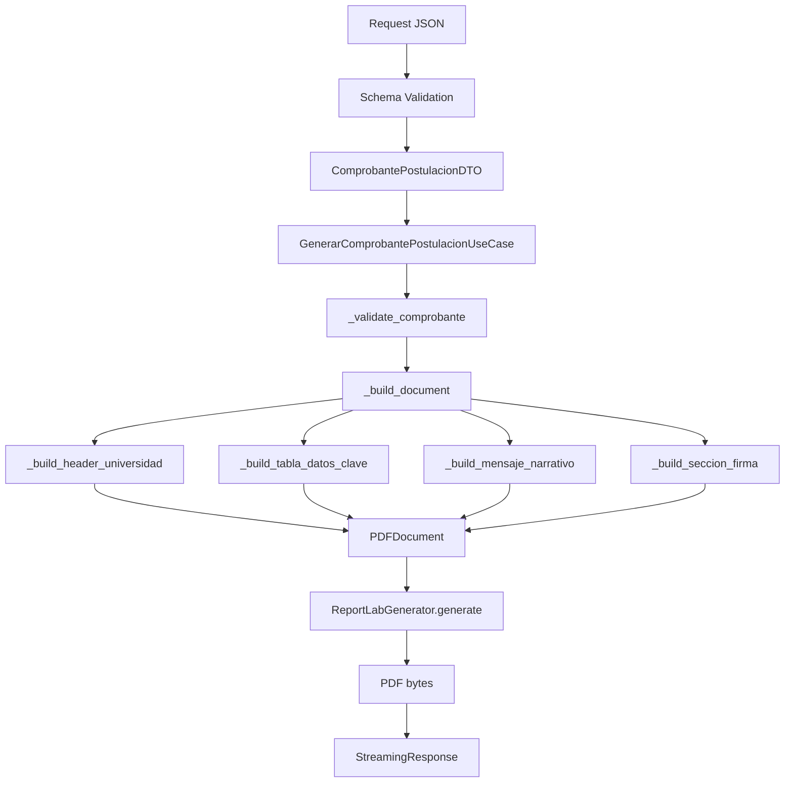

# Diseño Narrativo del PDF - Comprobante de Postulación

## Visión General

El PDF de comprobante de postulación utiliza un **diseño narrativo profesional** en lugar del tradicional formato tabular. Este documento explica la arquitectura y el flujo de generación.

---

## Arquitectura del Use Case

### Flujo de Generación

```
Request HTTP (JSON)
        ↓
Schema Pydantic (validación)
        ↓
DTO (transferencia interna)
        ↓
Use Case (construcción del documento)
        ↓
PDFDocument (entidad del dominio)
        ↓
IPDFGenerator (interfaz)
        ↓
ReportLabGenerator (implementación)
        ↓
PDF bytes (respuesta)
```

---

## Estructura del Use Case

### Clase: `GenerarComprobantePostulacionUseCase`

**Ubicación**: `src/application/use_cases/generar_comprobante_postulacion.py`

**Responsabilidad**: Construir un `PDFDocument` con estructura específica para comprobantes de postulación.

#### Método Principal: `execute()`

```python
def execute(
    self,
    comprobante: ComprobantePostulacionDTO,
    style: PDFStyle | None = None,
) -> GenerarComprobanteResult:
```

**Flujo interno**:
1. Valida datos mínimos requeridos (`_validate_comprobante`)
2. Construye el documento (`_build_document`)
3. Genera el PDF usando `IPDFGenerator`
4. Retorna resultado con contenido y metadata

---

## Estructura del Documento PDF

### 1. Header - Universidad

**Método**: `_build_header_universidad()`

```python
PDFSection(
    title=universidad.nombre,        # "Universidad Tecnológica Nacional"
    content=universidad.direccion,   # "Av. Siempreviva 123"
    level=1,                         # Título principal centrado
)
```

**Renderizado**:
- Título: Centrado, 18pt, color primario
- Dirección: Centrado, 10pt gris (estilo subtitle)

---

### 2. Título y Tabla de Datos Clave

**Método**: `_build_tabla_datos_clave()`

**Componentes**:

#### Título
```python
title=f"COMPROBANTE DE POSTULACIÓN N° {postulacion.numero}"
```

#### Subtítulo con Fecha
```python
content=f"Fecha de postulación: {fecha_en_español}"
```
- Fecha convertida a español timezone Argentina usando `parse_iso_to_spanish_argentina()`
- Ejemplo: `"20 de febrero de 2024 a las 11:30"`

#### Tabla Compacta

Una sola tabla con **8 filas** de datos esenciales:

| Campo | Información |
|-------|-------------|
| Estudiante | Nombre completo |
| DNI | Documento |
| Carrera | Nombre de la carrera |
| Empresa | Nombre de la empresa |
| Puesto | Nombre del puesto |
| Proyecto | Nombre + fecha de inicio |
| Materias aprobadas | Cantidad |
| Materias en condición regular | Cantidad |

**Características**:
- Headers: `["Campo", "Información"]`
- Anchos personalizados: `[55mm, 110mm]`
- Alineación: Izquierda
- Sin título individual (se usa el título de la sección)

---

### 3. Mensaje Narrativo

**Método**: `_build_mensaje_narrativo()`

**Propósito**: Crear un párrafo descriptivo que conecta todos los datos en formato de certificación oficial.

**Estructura**:

```
Por medio del presente se certifica que [ESTUDIANTE], alumno/a de 
[CARRERA] de la institución [UNIVERSIDAD], con DNI [DNI], se postuló 
para el proyecto "[PROYECTO]" ofrecido por [EMPRESA] para el puesto 
de [PUESTO]. El proyecto tiene fecha de inicio estimada: [FECHA].

Al momento de la postulación, el/la estudiante registra [N] materias 
aprobadas y [M] materias en condición regular. Esta postulación queda 
registrada bajo el número [NUMERO] y fue realizada el [FECHA].
```

**Formateo**:
- Usa HTML `<b>` para resaltar información clave
- Fechas en español timezone Argentina
- Texto fluido y legible

**Ejemplo de salida**:
> Por medio del presente se certifica que **Juan Pérez**, alumno/a de **Ingeniería en Sistemas de Información** de la institución **Universidad Tecnológica Nacional**, con DNI **12345678**, se postuló para el proyecto **"Desarrollo de Microservicios"** ofrecido por **Tech Solutions S.A.** para el puesto de **Desarrollador Backend Junior**. El proyecto tiene fecha de inicio estimada: **1 de marzo de 2024**.

---

### 4. Firma y Footer

**Método**: `_build_seccion_firma()`

**Componentes**:

```
[espacio]

__________________________________
Firma del responsable académico / Empresa

Contacto: oficina de prácticas - [UNIVERSIDAD]

Este comprobante es emitido electrónicamente y puede ser 
impreso para presentar en la empresa.
```

**Renderizado**:
- Nivel 3: Alineado a la derecha
- Fuente 9pt gris
- Espaciado adecuado

---

## Formateo de Fechas

### Utilidad: `parse_iso_to_spanish_argentina()`

**Ubicación**: `src/application/utils/date_utils.py`

**Conversión**:

| Entrada (ISO/UTC) | Salida (Español/Argentina UTC-3) |
|-------------------|----------------------------------|
| `2024-02-20T14:30:00Z` | `20 de febrero de 2024 a las 11:30` |
| `2024-03-01` | `1 de marzo de 2024` |
| `None` o `""` | `""` |

**Características**:
- Convierte UTC a timezone Argentina (UTC-3)
- Nombres de meses en español
- Soporta datetime completo o solo fecha
- Manejo robusto de errores (retorna string original si falla)

**Uso en el use case**:
```python
from src.application.utils.date_utils import parse_iso_to_spanish_argentina

fecha_postulacion = parse_iso_to_spanish_argentina(post.fecha)
fecha_inicio = parse_iso_to_spanish_argentina(proy.fecha_inicio)
```

---

## Integración con el Dominio

### Entidades Utilizadas

#### `PDFDocument`
```python
PDFDocument(
    title=f"Comprobante de Postulación N° {numero}",
    author="Sistema de Pasantías",
    page_size="A4",
    orientation="portrait",
    metadata={
        "numero_postulacion": numero,
        "tipo_documento": "comprobante_postulacion",
        "estudiante_dni": dni,
    },
)
```

#### `PDFSection`
- **level=1**: Headers y títulos principales (centrados)
- **level=2**: Cuerpo de texto (izquierda)
- **level=3**: Footers (derecha)

#### `PDFTable`
```python
PDFTable(
    headers=["Campo", "Información"],
    rows=[[campo1, valor1], [campo2, valor2], ...],
    title=None,  # Opcional
)
```

---

## Renderizado en ReportLab

### Estilos Aplicados

**Ubicación**: `src/infrastructure/pdf/reportlab_generator.py`

| Estilo | Uso | Tamaño | Alineación | Color |
|--------|-----|--------|------------|-------|
| `title` | Títulos nivel 1 | 18pt | Centro | Primario |
| `heading` | Subtítulos nivel 2 | 12pt | Centro | Primario |
| `body` | Texto normal | 10pt | Izquierda | Negro |
| `subtitle` | Fechas, metadatos | 10pt | Centro | Gris |
| `footer` | Firma, contacto | 9pt | Derecha | Gris |

### Tabla - Configuración

```python
# Anchos personalizados
col_widths = [55*mm, 110*mm]

# Estilos aplicados
TableStyle([
    ("BACKGROUND", (0, 0), (-1, 0), colors.whitesmoke),  # Header gris claro
    ("BOX", (0, 0), (-1, -1), 0.6, colors.grey),         # Borde exterior
    ("INNERGRID", (0, 0), (-1, -1), 0.4, colors.lightgrey),  # Grilla interna
    ("ALIGN", (0, 0), (-1, -1), "LEFT"),                 # Alineación izquierda
    ("FONTNAME", (0, 0), (-1, -1), "Helvetica"),
    ("FONTSIZE", (0, 0), (-1, -1), 10),
    ("VALIGN", (0, 0), (-1, -1), "MIDDLE"),
    # Padding uniforme de 6pt
])
```

---

## Ventajas del Diseño Narrativo

### vs. Diseño Tabular Tradicional

| Aspecto | Tabular | Narrativo |
|---------|---------|-----------|
| **Legibilidad** | Requiere escaneo de múltiples tablas | Flujo continuo, fácil de leer |
| **Espacio** | 2-3 páginas | 1 página |
| **Profesionalismo** | Datos crudos | Formato de certificación |
| **Mantenimiento** | Múltiples métodos `_build_seccion_*` | 4 métodos enfocados |
| **Fechas** | ISO técnico | Español localizado |
| **Énfasis** | Ninguno | Negritas HTML para datos clave |

---

## Ejemplo de Salida

### Request JSON
```json
{
  "estudiante": {"nombre": "Juan", "apellido": "Pérez", "dni": "12345678"},
  "universidad": {"nombre": "UTN", "direccion": "Av. Siempreviva 123"},
  "carrera": {"nombre": "Ing. en Sistemas de Información"},
  "empresa": {"nombre": "Tech Solutions S.A."},
  "proyecto": {"nombre": "Desarrollo de Microservicios", "fecha_inicio": "2024-03-01"},
  "puesto": {"nombre": "Desarrollador Backend Junior"},
  "postulacion": {
    "numero": 1024,
    "fecha": "2024-02-20T14:30:00Z",
    "cantidad_materias_aprobadas": 25,
    "cantidad_materias_regulares": 2
  }
}
```

### PDF Generado (Texto Aproximado)

```
                Universidad Tecnológica Nacional
                    Av. Siempreviva 123

            COMPROBANTE DE POSTULACIÓN N° 1024
        Fecha de postulación: 20 de febrero de 2024 a las 11:30

┌─────────────────────────┬──────────────────────────────┐
│ Estudiante              │ Juan Pérez                   │
│ DNI                     │ 12345678                     │
│ Carrera                 │ Ing. en Sistemas...          │
│ Empresa                 │ Tech Solutions S.A.          │
│ Puesto                  │ Desarrollador Backend Junior │
│ Proyecto                │ Desarrollo de... (inicio...) │
│ Materias aprobadas      │ 25                           │
│ Materias regulares      │ 2                            │
└─────────────────────────┴──────────────────────────────┘

Por medio del presente se certifica que Juan Pérez, 
alumno/a de Ingeniería en Sistemas de Información de la 
institución Universidad Tecnológica Nacional, con DNI 
12345678, se postuló para el proyecto "Desarrollo de 
Microservicios" ofrecido por Tech Solutions S.A. para 
el puesto de Desarrollador Backend Junior. El proyecto 
tiene fecha de inicio estimada: 1 de marzo de 2024.

Al momento de la postulación, el/la estudiante registra 
25 materias aprobadas y 2 materias en condición regular. 
Esta postulación queda registrada bajo el número 1024 y 
fue realizada el 20 de febrero de 2024 a las 11:30.


                        __________________________________
                        Firma del responsable académico / Empresa

                        Contacto: oficina de prácticas - UTN

                        Este comprobante es emitido electrónicamente 
                        y puede ser impreso para presentar en la empresa.
```

---

## Flujo Completo de Generación



---

## Mantenimiento Futuro

### Para Agregar Nuevos Campos

1. Actualizar DTO (`negocio_global_dtos.py`)
2. Actualizar Schema (`comprobante_postulacion_schemas.py`)
3. Decidir dónde incluirlo:
   - **Tabla compacta**: Agregar fila en `_build_tabla_datos_clave()`
   - **Mensaje narrativo**: Modificar string en `_build_mensaje_narrativo()`
   - **Nueva sección**: Crear nuevo método `_build_seccion_*()`

### Para Cambiar Estilos

Modificar `ReportLabGenerator._create_styles()` en:
- `src/infrastructure/pdf/reportlab_generator.py`

### Para Cambiar Idioma de Fechas

Modificar `MESES_ES` en:
- `src/application/utils/date_utils.py`

---

## Referencias

- [architecture.md](./architecture.md) - Arquitectura general del proyecto
- [api_integration.md](./api_integration.md) - Integración con APIs externas
- Clean Architecture - Uncle Bob
