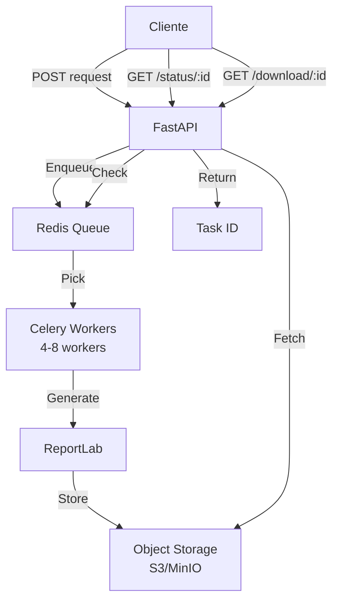
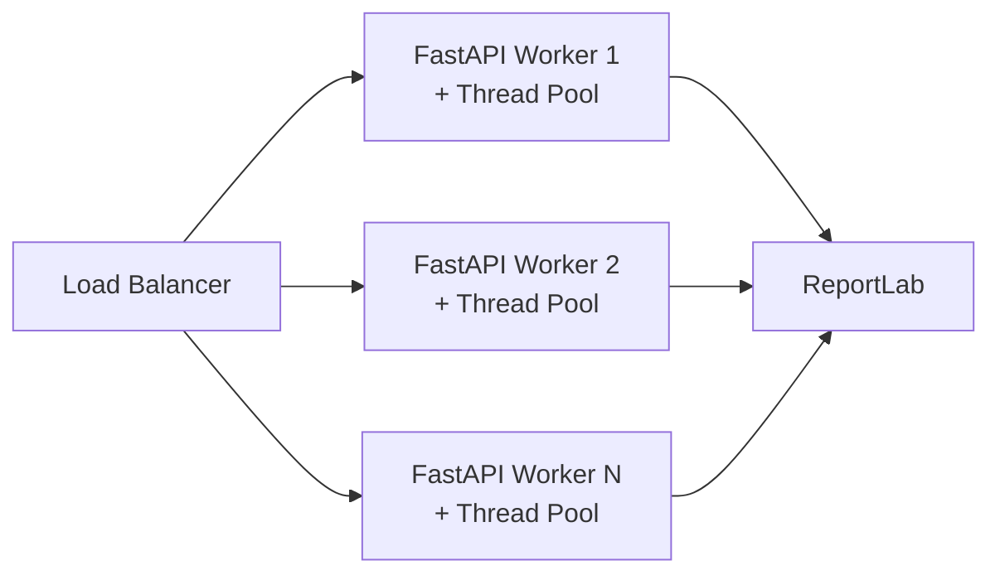

# Análisis de Optimización: Endpoint `/api/v1/pdf/generate/comprobante_postulacion`

## Resumen Ejecutivo

> [!CAUTION]
> **El endpoint NO está optimizado para manejar 100,000 requests**. Con la configuración actual, el sistema tendría problemas graves de rendimiento y probablemente fallaría ante cargas altas.

**Capacidad Estimada Actual**: ~500-1,000 requests/hora (sin optimización)  
**Objetivo Requerido**: 100,000 requests (sin especificación de tiempo)  
**Estado General**: ⚠️ **CRÍTICO - Requiere optimización significativa**

---

## 1. Arquitectura Actual

### Stack Tecnológico
- **Framework**: FastAPI + Uvicorn
- **Generación PDF**: ReportLab
- **Patrón**: Clean Architecture
- **Despliegue**: Docker (single container)

### Flujo del Request


---

## 2. Cuellos de Botella Identificados

### 🔴 **CRÍTICOS** (Impacto Alto)

#### 2.1 Sincronía Total del Endpoint
**Ubicación**: [router.py:L66-158](file:///h:/microservicio%20PDF/Microservicio-PDF/src/presentation/api/v1/router.py#L66-L158)

```python
async def generar_comprobante_postulacion(
    request: ComprobantePostulacionRequest,
    use_case=Depends(get_generar_comprobante_postulacion_use_case),
):
    # ⚠️ PROBLEMA: Función definida como 'async' pero ejecuta código síncrono
    result = use_case.execute(comprobante_dto)  # ❌ Bloquea el event loop
```

**Impacto**:
- La función está marcada como `async` pero **no usa `await`**
- `use_case.execute()` es completamente síncrono y **bloquea el event loop de asyncio**
- Durante la generación del PDF (~100-500ms), **Uvicorn no puede procesar otros requests**
- Con 1 worker, el throughput máximo es ~2-10 requests/segundo

**Solución Requerida**:
- Mover la generación de PDF a un thread pool: `await asyncio.to_thread()`
- O usar Celery para procesamiento asíncrono con cola

---

#### 2.2 Generación de PDF Intensiva en CPU
**Ubicación**: [reportlab_generator.py:L116-161](file:///h:/microservicio%20PDF/Microservicio-PDF/src/infrastructure/pdf/reportlab_generator.py#L116-L161)

```python
def generate_to_stream(self, document, stream, style):
    # ⚠️ Proceso completamente síncrono y CPU-intensive
    doc = SimpleDocTemplate(stream, ...)
    elements = self._build_elements(document, style)  # CPU-bound
    doc.build(elements)  # ❌ 100-500ms por documento
```

**Costos de Rendimiento**:
- **Creación de estilos**: ~10-20ms (se recrea en cada request)
- **Construcción de elementos**: ~30-80ms (parsing, formateo)
- **Generación ReportLab**: ~50-300ms (layout, rendering)
- **Total por PDF**: ~100-500ms en CPU

**Problemas**:
- Sin caché de estilos (se recrean en cada request)
- Sin reutilización de configuraciones
- Sin paralelización

---

#### 2.3 Mapeo Manual Masivo de DTOs
**Ubicación**: [router.py:L92-143](file:///h:/microservicio%20PDF/Microservicio-PDF/src/presentation/api/v1/router.py#L92-L143)

```python
comprobante_dto = ComprobantePostulacionDTO(
    estudiante=EstudianteDTO(
        nombre=request.estudiante.nombre,
        apellido=request.estudiante.apellido,
        # ... 52 líneas más de mapeo manual
    ),
    # ... 37 líneas más
)
```

**Impacto**:
- 89 líneas de código de mapeo manual
- Alto tiempo de CPU en cada request (~5-15ms)
- Propenso a errores
- Difícil de mantener

**Solución**:
- Usar `model_dump()` y `model_validate()` de Pydantic
- O eliminar la capa de DTOs redundante

---

### 🟡 **ALTOS** (Impacto Medio-Alto)

#### 2.4 Configuración de Uvicorn para Desarrollo
**Ubicación**: [Dockerfile:L73](file:///h:/microservicio%20PDF/Microservicio-PDF/Dockerfile#L73)

```dockerfile
CMD ["uvicorn", "src.main:app", "--host", "0.0.0.0", "--port", "8000"]
```

**Problemas**:
- **Solo 1 worker**: Procesa 1 request a la vez
- **Sin workers multiprocess**: No aprovecha múltiples CPU cores
- **Sin Gunicorn**: Uvicorn standalone no es óptimo para producción

**Capacidad Actual vs Óptima**:
- Actual: 1 worker = ~2-10 req/s
- Con 4 workers: ~8-40 req/s
- Con 8 workers + optimizaciones: ~50-200 req/s

---

#### 2.5 Falta de Caché
**Ubicación**: Toda la aplicación

**Oportunidades de Caché**:
1. **Estilos PDF**: Se recrean en cada request (pueden ser singleton)
2. **Configuración de universidad**: Probablemente se repite entre requests
3. **Templates de secciones**: Estructura estática del documento

**Impacto Potencial**:
- Reducción de ~20-40ms por request con caché de estilos
- Reducción de ~10-30ms con caché de templates

---

#### 2.6 Sin Rate Limiting
**Ubicación**: No implementado

**Riesgos**:
- Sin protección contra DDoS
- Sin throttling por cliente
- Sin priorización de requests

---

### 🟢 **MEDIOS** (Impacto Bajo-Medio)

#### 2.7 Validaciones Redundantes
- Pydantic valida en el endpoint
- El use case valida nuevamente los datos
- Validación doble innecesaria (~5-10ms overhead)

#### 2.8 Parsing de Fechas en Tiempo de Ejecución
**Ubicación**: [generar_comprobante_postulacion.py:L227,237](file:///h:/microservicio%20PDF/Microservicio-PDF/src/application/use_cases/generar_comprobante_postulacion.py#L227-L237)

```python
fecha_inicio = parse_iso_to_spanish_argentina(proy.fecha_inicio)
```

- Se parsea la fecha múltiples veces en el mismo documento
- Sin caché de resultados de parsing

#### 2.9 Falta de Métricas y Observabilidad
- Sin logging de tiempos de procesamiento
- Sin métricas de Prometheus
- Sin tracing distribuido
- Imposible detectar degradación de rendimiento

---

## 3. Capacidad Actual Estimada

### Benchmarks Estimados (Sin Testing Real)

| Escenario | Requests/Segundo | Requests/Hora | 100k Requests |
|-----------|------------------|---------------|---------------|
| **Actual (1 worker)** | 2-10 | 7,200-36,000 | 2.7-14 horas |
| **4 workers** | 8-40 | 28,800-144,000 | 0.7-3.5 horas |
| **8 workers + thread pool** | 50-150 | 180,000-540,000 | 11-33 minutos |
| **Workers + cache + async** | 200-500 | 720,000-1,800,000 | 3-8 minutos |

> [!NOTE]
> Estos son **estimados teóricos**. Se requiere load testing real para confirmar.

---

## 4. Recomendaciones Priorizadas

### ✅ **NIVEL 1: Optimizaciones Críticas** (Impacto: 10-50x)

#### R1.1: Implementar Procesamiento Asíncrono Real
**Prioridad**: 🔴 **CRÍTICA**  
**Esfuerzo**: Medio (4-6 horas)  
**Impacto**: 5-10x throughput

**Implementación**:
```python
# router.py
async def generar_comprobante_postulacion(...):
    # Ejecutar generación en thread pool
    result = await asyncio.to_thread(
        use_case.execute,
        comprobante_dto
    )
    # ... resto del código
```

**Alternativa (más escalable)**:
- Implementar cola de tareas con Celery + Redis
- Endpoint retorna ID de tarea
- Cliente consulta status y descarga cuando esté listo

---

#### R1.2: Configurar Uvicorn con Múltiples Workers
**Prioridad**: 🔴 **CRÍTICA**  
**Esfuerzo**: Bajo (1-2 horas)  
**Impacto**: 4-8x throughput

**Implementación**:
```dockerfile
# Dockerfile
CMD ["gunicorn", "src.main:app", \
     "--workers", "4", \
     "--worker-class", "uvicorn.workers.UvicornWorker", \
     "--bind", "0.0.0.0:8000", \
     "--timeout", "120"]
```

**Configuración Recomendada**:
- Workers: `(2 × CPU_cores) + 1`
- Para 4 cores: 9 workers
- Para 8 cores: 17 workers

---

#### R1.3: Implementar Caché de Estilos
**Prioridad**: 🔴 **ALTA**  
**Esfuerzo**: Bajo (2-3 horas)  
**Impacto**: 20-30% reducción de latencia

**Implementación**:
```python
# reportlab_generator.py
from functools import lru_cache

class ReportLabGenerator(IPDFGenerator):
    def __init__(self):
        self._styles_cache = self._create_default_styles()
    
    @lru_cache(maxsize=10)
    def _create_styles(self, style: PDFStyle) -> dict:
        # Cachear estilos por configuración
        ...
```

---

### ✅ **NIVEL 2: Optimizaciones Altas** (Impacto: 2-5x)

#### R2.1: Simplificar Mapeo de DTOs
**Prioridad**: 🟡 **ALTA**  
**Esfuerzo**: Medio (3-4 horas)  
**Impacto**: 10-20% reducción de latencia

**Implementación**:
```python
# router.py - Opción 1: Usar model_dump
comprobante_dto = ComprobantePostulacionDTO(
    estudiante=EstudianteDTO(**request.estudiante.model_dump()),
    universidad=UniversidadDTO(**request.universidad.model_dump()),
    # ... resto
)

# Opción 2: Eliminar DTOs redundantes y usar schemas directamente
```

---

#### R2.2: Implementar Pool de Conexiones/Recursos
**Prioridad**: 🟡 **MEDIA**  
**Esfuerzo**: Medio (4-5 horas)  
**Impacto**: 15-25% mejora en concurrencia

- Thread pool executor para PDF generation
- Process pool para paralelización extrema

---

#### R2.3: Agregar Rate Limiting
**Prioridad**: 🟡 **MEDIA**  
**Esfuerzo**: Bajo (2-3 horas)  
**Impacto**: Protección contra sobrecarga

**Implementación**:
```python
from slowapi import Limiter
from slowapi.util import get_remote_address

limiter = Limiter(key_func=get_remote_address)

@router.post("/generate/comprobante_postulacion")
@limiter.limit("100/minute")  # 100 requests por minuto por IP
async def generar_comprobante_postulacion(...):
    ...
```

---

### ✅ **NIVEL 3: Optimizaciones Medias** (Impacto: 1.2-2x)

#### R3.1: Optimizar Parsing de Fechas
**Prioridad**: 🟢 **BAJA**  
**Esfuerzo**: Bajo (1 hora)

```python
# Cachear resultados dentro del use case
@lru_cache(maxsize=100)
def parse_iso_to_spanish_argentina(date_str: str) -> str:
    ...
```

---

#### R3.2: Implementar Métricas y Observabilidad
**Prioridad**: 🟡 **MEDIA**  
**Esfuerzo**: Medio (4-6 horas)

```python
from prometheus_client import Counter, Histogram

pdf_requests = Counter('pdf_requests_total', 'Total PDF requests')
pdf_duration = Histogram('pdf_generation_duration_seconds', 'PDF generation time')

@router.post("/generate/comprobante_postulacion")
async def generar_comprobante_postulacion(...):
    pdf_requests.inc()
    with pdf_duration.time():
        result = await asyncio.to_thread(use_case.execute, comprobante_dto)
    ...
```

---

#### R3.3: Streaming Response Optimizado
**Prioridad**: 🟢 **BAJA**  
**Esfuerzo**: Bajo (2 horas)

```python
# Generar chunks del PDF progresivamente
async def generate_pdf_stream():
    buffer = BytesIO()
    await asyncio.to_thread(use_case.execute_to_stream, comprobante_dto, buffer)
    buffer.seek(0)
    yield buffer.read(8192)  # Enviar en chunks de 8KB
```

---

## 5. Arquitectura Propuesta para 100K Requests

### Opción A: Cola de Tareas Asíncrona (Recomendada)



**Ventajas**:
- Desacopla generación de HTTP request
- Alta escalabilidad horizontal
- Retry automático en fallos
- Monitoreo de progreso

**Componentes**:
- FastAPI: API Gateway
- Celery: Task queue
- Redis: Message broker
- MinIO/S3: Almacenamiento temporal de PDFs

---

### Opción B: Multi-Worker con Thread Pool (Más Simple)



**Configuración**:
- Gunicorn con 8-16 workers
- Thread pool de 4-8 threads por worker
- Caché compartido con Redis

**Ventajas**:
- Más simple de implementar
- Sin componentes externos
- Latencia más baja

**Desventajas**:
- Escalabilidad vertical limitada
- Sin retry automático
- Riesgo de timeout en requests lentos

---

## 6. Plan de Implementación Sugerido

### Fase 1: Quick Wins (1-2 días)
1. ✅ Configurar Gunicorn con múltiples workers
2. ✅ Implementar `asyncio.to_thread()` en endpoint
3. ✅ Agregar caché de estilos PDF
4. ✅ Simplificar mapeo de DTOs con `model_dump()`

**Resultado Esperado**: 5-10x mejora en throughput

---

### Fase 2: Optimizaciones Medias (3-5 días)
1. ✅ Implementar rate limiting
2. ✅ Agregar métricas de Prometheus
3. ✅ Configurar logging estructurado
4. ✅ Optimizar parsing y validaciones

**Resultado Esperado**: 2-3x mejora adicional

---

### Fase 3: Arquitectura Escalable (1-2 semanas)
1. ✅ Implementar Celery + Redis (opcional)
2. ✅ Configurar horizontal pod autoscaling (Kubernetes)
3. ✅ Implementar almacenamiento distribuido
4. ✅ Load testing y ajuste fino

**Resultado Esperado**: Capacidad para 100K+ requests/hora

---

## 7. Testing y Validación

### Load Testing Recomendado

#### Herramientas
- **Locust**: Para simular carga realista
- **k6**: Para benchmarks rápidos
- **Artillery**: Para CI/CD

#### Escenarios de Prueba

```python
# locustfile.py
from locust import HttpUser, task, between

class PDFUser(HttpUser):
    wait_time = between(1, 3)
    
    @task
    def generate_pdf(self):
        payload = {
            "estudiante": {...},
            "universidad": {...},
            # ... datos completos
        }
        self.client.post("/api/v1/pdf/generate/comprobante_postulacion", json=payload)
```

**Comandos**:
```bash
# Test con 100 usuarios concurrentes
locust -f locustfile.py --host http://localhost:8000 -u 100 -r 10

# Test de 1000 requests
k6 run --vus 50 --duration 30s script.js
```

---

### Métricas Objetivo

| Métrica | Objetivo Mínimo | Objetivo Ideal |
|---------|-----------------|----------------|
| **Throughput** | 50 req/s | 200+ req/s |
| **P50 Latency** | < 500ms | < 200ms |
| **P95 Latency** | < 2s | < 1s |
| **P99 Latency** | < 5s | < 2s |
| **Error Rate** | < 1% | < 0.1% |
| **CPU Usage** | < 80% | < 60% |
| **Memory** | < 2GB | < 1GB |

---

## 8. Costos vs Beneficios

| Optimización | Esfuerzo | Impacto | ROI |
|--------------|----------|---------|-----|
| R1.1: Async processing | Medio | 5-10x | 🟢 Alto |
| R1.2: Multiple workers | Bajo | 4-8x | 🟢 Muy Alto |
| R1.3: Style caching | Bajo | 1.3x | 🟢 Alto |
| R2.1: DTO simplification | Medio | 1.2x | 🟡 Medio |
| R2.2: Rate limiting | Bajo | N/A | 🟢 Alto (seguridad) |
| R3.1: Date parsing cache | Bajo | 1.05x | 🟡 Medio |
| R3.2: Observability | Medio | N/A | 🟢 Alto (operacional) |

---

## 9. Conclusiones

### Estado Actual
- ❌ **NO optimizado** para 100K requests
- ⚠️ Múltiples cuellos de botella críticos
- 🔄 Arquitectura síncrona bloqueante
- 📊 Sin métricas ni observabilidad

### Acciones Inmediatas Recomendadas
1. **Implementar R1.2** (múltiples workers) - Impacto inmediato
2. **Implementar R1.1** (async processing) - Crítico para escalabilidad
3. **Implementar R1.3** (caché de estilos) - Quick win fácil
4. **Realizar load testing** - Validar mejoras

### Capacidad Post-Optimización
Con las optimizaciones de Nivel 1 y 2:
- **Throughput estimado**: 100-300 req/s
- **100K requests**: 5-15 minutos
- **Escalabilidad**: Horizontal con workers adicionales

---

## 10. Recursos Adicionales

### Documentación
- [FastAPI Performance](https://fastapi.tiangolo.com/deployment/concepts/)
- [Gunicorn Deployment](https://docs.gunicorn.org/en/stable/design.html)
- [ReportLab Optimization](https://www.reportlab.com/docs/reportlab-userguide.pdf)

### Monitoreo Sugerido
- Prometheus + Grafana
- Sentry para error tracking
- Jaeger para distributed tracing
